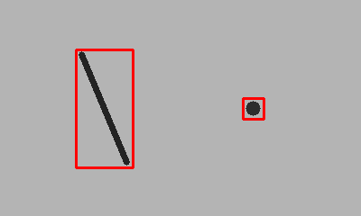

# Wind-Blade Inspection — Undergraduate Robotics Research

[](https://github.com/BadrEss01/wind-blade-inspection/actions/workflows/tests.yml)

During my undergraduate research assistant work at Jacobs University Bremen, I contributed to a cooperative project with Acquahmeyer Drone Tech exploring how a UAV could deploy a climbing robot onto a wind turbine blade for contact inspection.

My focus was the ground robot. I worked on the research behind its design as well as its development in Fusion 360, 3D printing, assembly, and programming. This repository brings together the research report, the robot design, and a later surface-inspection software extension.

**[Read the research report (PDF)](docs/research/wind-blade-inspection-report.pdf)** · [Research overview](docs/research/README.md) · [Robot design](docs/robot-design.md)

## Undergraduate research assistant work

A substantial part of my work involved investigating how a robot could attach to and move along a blade surface. Within the team, I contributed to:

- **Literature review and concept comparison:** studying existing climbing robots and comparing suction, magnetic adhesion, and gripping approaches.
- **Requirements and design trade-offs:** considering weight, center of mass, surface protection, energy use, and adaptation to changes in the climbing surface.
- **Adhesion and locomotion research:** investigating passive suction cups and a belt-driven mechanism, including cup attachment, pressing, and release.
- **Mechanical design and prototyping:** developing the climbing platform in Fusion 360 and working on printed components, assembly, and programming.
- **Research documentation:** coauthoring the report, which connects the design rationale with calculations, force analysis, and a proposed suction-cup test setup.

The report documents the team's combined work. Its UAV perception and deployment studies provide the wider system context; my main contribution was to the ground robot.

## Research report

*Wind Blade Inspection System with Unmanned Aerial Vehicle and Ground Robot*  
**Badr Essefiany, Calin Constantin Clichici, Dongwook Lee, and Wail Bougida**  
Project Report of Cooperative Work — Jacobs University Bremen  
Supervision: Acquahmeyer Drone Tech and Prof. Francesco Maurelli

For the climbing-robot research, start with **Section 2.1** (literature review), **Sections 3.3–3.4** (requirements, design, and assembly), and **Section 4.2** (force analysis and the proposed adhesion experiment).


*Design illustrations from the coauthored report.*

## Visual inspection extension

In September 2026, I added a still-image inspection extension using OpenCV and a trainable PyTorch U-Net. It provides a way to explore surface screening alongside the original robot research. Development used AI coding assistance.

The extension is separate from the original research implementation. Current verification uses synthetic images; the detector has not been integrated with the robot or validated on real turbine defects.

## Try it

Requires Python 3.10 or newer. From the repository root:

```bash
python -m venv .venv
# Linux/macOS:
source .venv/bin/activate
# Windows PowerShell instead:
# .venv\Scripts\Activate.ps1
python -m pip install -e .
python scripts/make_demo.py
blade-inspect examples/synthetic_surface.png --output-dir outputs/demo
python -m unittest discover -s tests -v
```

Inspect your own photograph:

```bash
blade-inspect path/to/image.jpg --output-dir outputs/my-image --threshold 22 --min-area 20 --blur-kernel 31
```

Each run writes `overlay.png`, `mask.png` and `report.json`. Boxes use `[x, y, width, height]` in pixels. Parameters and image dimensions are saved with the results. Use a separate output directory for each image; existing output files in that directory are replaced.

## Example result



The demo input is generated, not a blade photograph. The dark line and spot demonstrate software behavior only. Recreate the sample and outputs with `python scripts/make_demo.py`.

## Trainable ML segmentation (2026 extension)

A compact PyTorch U-Net complements the classical OpenCV baseline. It includes
paired image/mask loading, group-aware split checks, augmentation, BCE + Dice loss,
validation-based checkpoint selection, held-out evaluation and inference exports.
No pretrained or real-blade-trained weights are bundled. Read the [model card](docs/MODEL_CARD.md).

Run the complete synthetic smoke experiment from the repository root:

```bash
python -m pip install 'torch>=2.6,<3' --index-url https://download.pytorch.org/whl/cpu
python -m pip install -e '.[ml]'
python scripts/make_training_demo.py
blade-ml train data/synthetic/manifest.csv --output outputs/ml --epochs 20 --size 64 --data-kind synthetic
blade-ml evaluate outputs/ml/best.pt data/synthetic/manifest.csv
blade-ml predict outputs/ml/best.pt data/synthetic/image_21.png --output outputs/ml-preview
```

For your own labeled data, use CSV columns `image,mask,split,group`; paths are relative
to the manifest. Keep each blade/capture session within one split. Training requires
train and val rows; final evaluation requires test rows. Masks use 0/255 pixels.
Use `--data-kind real` only for actual photographed data. Synthetic metrics measure pipeline behavior rather than field accuracy.

The ML commands export checkpoints/history, pixel-level metrics, probability arrays,
masks and overlays. The simple baseline remains available for comparison.

## Robot design details

The report describes two belt-driven climbing modules with passive suction cups. A guide rail presses cups onto the surface, manages their transition and detachment, and uses a tail to help balance reaction forces. A swivel couples the modules to the payload chassis to support turning.

The assembly section specifies two 12 V, 146 RPM brushed DC motors with encoders, a dual H-bridge driver and an HX711-based force-sensor module. It describes PID mobility control using an ArduPilot board. Original CAD source, wiring, firmware and experiment logs have not been recovered, so this is design documentation rather than a build-ready hardware release.

Read the [hardware design and evidence](docs/robot-design.md), [inspection method and validation](docs/inspection.md), and [authorship and sources](docs/provenance.md).

## Repository layout

| Location | Contents |
| --- | --- |
| `src/blade_inspection/` | Detection library and command-line interface |
| `tests/` | Detector and end-to-end file-output tests |
| `examples/` | Synthetic input, reference mask and generated outputs |
| `scripts/make_demo.py` | Deterministic sample generator |
| `docs/` | Robot design, inspection method, model card, and project sources |
| `docs/research/` | Research report PDF and reading guide |
| `.github/workflows/` | Automated tests on Python 3.10 and 3.12 |

## Current limitations and next steps

The executable pipeline highlights local grayscale contrast, removes small regions and exports reviewable outputs. It does not distinguish cracks from dirt, shadows or reflections, determine structural severity, control a robot or provide a safety decision. Thin cracks may disappear during morphological filtering. No field accuracy, payload capability or autonomous blade-climbing performance is claimed.

Next technical milestones: collect legally usable labelled blade images, evaluate false positives and missed defects, compare against a learned detector, then validate a camera interface independently of robot motion. See [validation plan](docs/inspection.md#validation-plan).

[Badr's profile](https://github.com/BadrEss01) · [Source and reuse notes](NOTICE.md)
