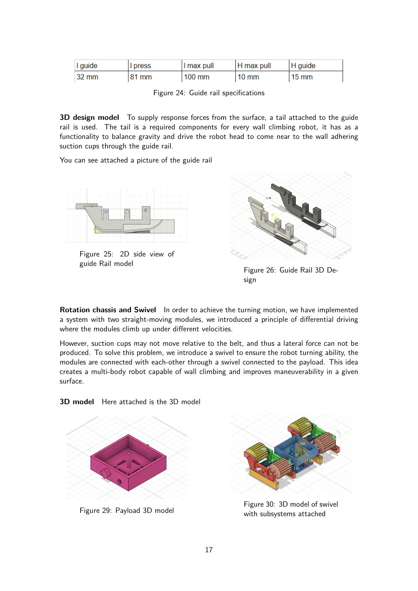

# Climbing Robot — Research and Design

## Research context

My undergraduate research assistant work focused on the ground robot within a cooperative wind-blade inspection system. The wider concept used a UAV to transport the robot and a deployment arm to place it on the blade.

I worked on the research behind the climbing mechanism, its Fusion 360 design, printed components, assembly, and programming. The [coauthored research report](research/wind-blade-inspection-report.pdf) documents the team's system concept and technical work.

## From literature review to design

The study compared existing climbing robots and adhesion approaches, including suction, magnetic attachment, and gripping. The ground-robot requirements covered weight, center of mass, non-destructive surface contact, terrain adaptation, energy consumption, and reliability.

The resulting concept used passive suction cups carried by a belt-and-pulley system. Its design addressed both holding force and the sequence of pressing, attaching, and releasing each cup during movement.

## Mechanism

| Subsystem | Design | Report section |
| --- | --- | --- |
| Adhesion | Passive suction cups; attachment depends on pressing force, seal, and surface conditions | 3.3.2, printed pp. 12–14 |
| Locomotion | Belt-and-pulley drive carrying cups through attachment and release zones | 3.3.2, pp. 13–15 |
| Guide rail | Distributes load and controls cup pressing, transition, and release; a tail helps balance reaction forces | pp. 15–17 |
| Turning | Two climbing modules with differential movement and a swivel connecting them to the payload | p. 17 |
| Actuation | Two 12 V, 146 RPM brushed DC motors with encoders and a dual H-bridge driver | 3.4, p. 18 |
| Force sensing | HX711-based force-sensor module | 3.4, p. 18 |
| Control | PID mobility control using an ArduPilot board, as described in the report | 3.4, p. 18 |

The report's 15 kg limit is a design requirement. It is not a measured robot mass or demonstrated payload.

## Calculations and experiment design

The report discusses suction holding force, friction, belt-drive kinematics, motor torque, and static force equilibrium. It also considers the extra load introduced by a possible maintenance arm.

A proposed test rig uses a motor-driven plate and force sensor to investigate the relationship between suction-cup pressing force and detachment force. Varying the pressing force would help identify suitable attachment conditions. Numerical adhesion results and raw experiment logs are not available in this repository.

## Prototype

The report includes Fusion 360 illustrations and a photograph of a 3D-printed guide rail. These document the design and prototype development; reliable vertical climbing, turning, and outdoor blade operation still require experimental validation.

*Illustrations from the report by Badr Essefiany, Calin Constantin Clichici, Dongwook Lee, and Wail Bougida.*

## Available material and future work

The repository contains the report, design overview, and a later image-inspection extension. Original CAD files, wiring, firmware, and raw test logs are not included.

A future integration could feed camera images into the inspection pipeline. Camera calibration, surface registration, adhesion monitoring, and motion control would need to be developed and tested before physical inspection trials.

[Research report and reading guide](research/README.md) · [Back to project](../README.md)
